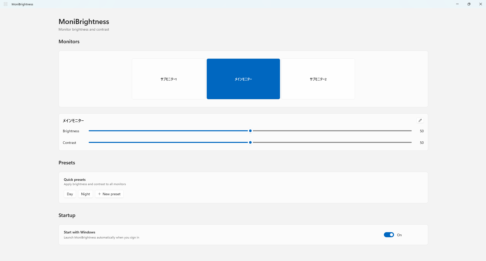

# MoniBrightness

Windows で複数モニターの明るさ・コントラストをまとめて調整するためのアプリです。

DDC/CI を利用して、対応している外部モニターを直接操作します。

## 機能

- モニターごとの明るさ調整
- モニターごとのコントラスト調整
- 複数モニター対応
- モニター配置の表示・選択
- モニター名の変更
- プリセットの保存・適用・編集
- タスクトレイからのクイック操作
- Windows サインイン時の自動起動

## 動作環境

- Windows 11
- x64
- DDC/CI に対応したモニター
- モニター側で DDC/CI が有効になっていること

## インストール

1. Releases から最新の `.msix` と `devcert.cer` をダウンロードします。
2. `devcert.cer` を信頼された証明書としてインストールします。
3. `.msix` ファイルをダブルクリックします。
4. 「インストール」をクリックします。
5. スタートメニューから MoniBrightness を起動します。

> 現在は自己署名証明書を使用して配布しています。

## 使い方

### メイン画面

メイン画面では以下の操作ができます。

- モニターの選択
- 明るさ・コントラストの調整
- モニター名の変更
- プリセットの管理
- Windows 起動時の自動起動設定

### タスクトレイ

MoniBrightness はタスクトレイに常駐します。

- 左クリック: クイック操作画面を表示
- 右クリック: 設定画面を開く / アプリを終了

## プリセット

現在の各モニターの明るさ・コントラストをプリセットとして保存できます。

保存したプリセットを選択すると、複数モニターへまとめて設定を適用できます。

## 注意事項

MoniBrightness は DDC/CI を使ってモニターを操作します。

モニターによっては DDC/CI に対応していない場合があります。
また、対応モニターでもモニター本体の設定画面から DDC/CI を有効にする必要がある場合があります。

## License

MIT License